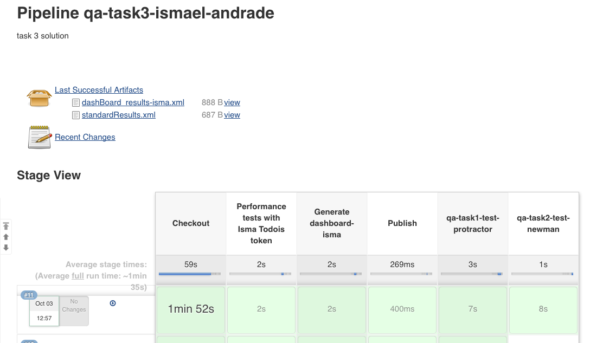
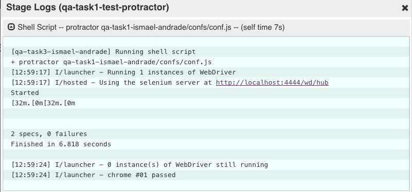
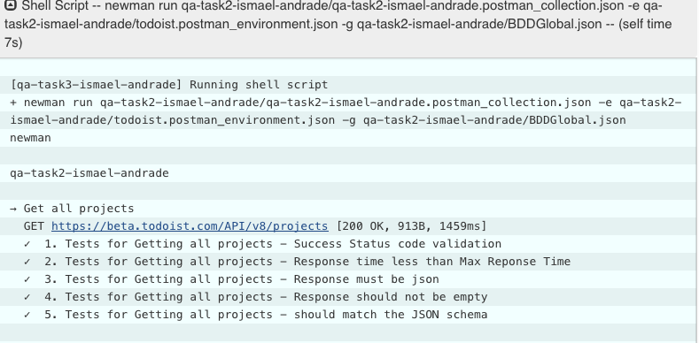

# qa-academy-performance-task3-ismael-andrade

## Run Jmeter non-gui mode
```
jmeter -n -t api_tests.jmx -l results-isma.jtl
```

## Generate dashboard
```
jmeter -g results-isma.jtl -o dashboard-isma
```

## Jenkins Prerequisites
* webdriver up and running
* protractor installed globally so Jenkins can call it
* protractor configured in headless mode
* newman installed globally so Jenkins can call it

## Evidence

<p>
  
</p>
<p>
  
</p>
<p>
  
</p>

## Jenkins pipeline
```
pipeline {
    agent any
    stages {
        stage('Checkout') {
            steps {
                cleanWs()
                checkout([$class: 'GitSCM', branches: [[name: '*/master']], doGenerateSubmoduleConfigurations: false, extensions: [], submoduleCfg: [], userRemoteConfigs: [[url: 'https://github.com/ismaelandrade/qa-task3-ismael-andrade.git']]])
            }
        }
        stage('Performance tests with Isma Todois token') {
            steps {

                withEnv(['JMETER_HOME=apache-jmeter-5.0/bin']) {
                    sh '$JMETER_HOME/jmeter -n -t api_tests.jmx -l results-isma.jtl'
                }
            }
        }
        stage('Generate dashboard-isma') {
            steps {
                sh 'rm -rf dashboard-isma'
                withEnv(['JMETER_HOME=apache-jmeter-5.0/bin']) {
                    sh '$JMETER_HOME/jmeter -g results-isma.jtl -o dashboard-isma'
                }
            }
        }
        stage('Publish') {
            steps {
                publishHTML([allowMissing: true, alwaysLinkToLastBuild: true, keepAll: true, reportDir: 'dashboard-isma', reportFiles: 'index.html', reportName: 'Dashboard', reportTitles: ''])
                perfReport percentiles: '0,50,90,100', sourceDataFiles: 'results-isma.jtl'
            }
        }
        stage('qa-task1-test-protractor') {
            steps {
                withNPM(npmrcConfig: 'my-custom-nprc') {
                    sh 'npm install -g protractor'
                }       
            }
        }
        stage('qa-task2-test-newman') {
            steps {
                sh 'newman run qa-task2-ismael-andrade/qa-task2-ismael-andrade.postman_collection.json  -e qa-task2-ismael-andrade/todoist.postman_environment.json -g qa-task2-ismael-andrade/BDDGlobal.json'
            }

        }
    }
}
```
